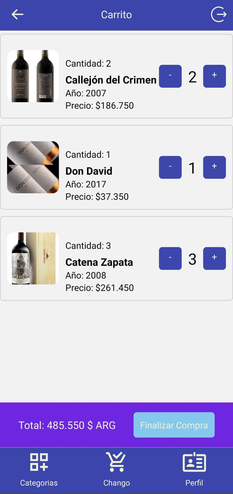

# App de Ecommerce de vino (Proyecto final - Curso MOBILE) 

Este proyecto es una app interactiva de Ecommerce que incluye varias funcionalidades como carrito, creación de perfiles con toma de fotografía -utilizando la cámara del dispositivo-. Utiliza REDUX TOOLKIT, SQLite para guardar la sesión por más que se reinicie la app o el dispositivo, Device Features: Cámara (Como ya dijimos, para las fotos del perfil del usuario), ocupamos Firebase tanto para persistencia de los datos (Vinos, precios, carrito, etc) utilizando Realtime Data Base, como también para la autenticación para crear una experiencia de usuario dinámica y responsiva.

## Tabla de Contenidos

- [1. Descripción](#descripcion)
- [1.1. Pantalla Categorías](#catego)
- [1.2. Pantalla 'Carrito'](#carro)
- [1.3. Pantalla 'MyProfile'](#profi)
- [Instalación](#instalación)
- [Uso](#uso)
- [LocalStorage y Fetch](#localstorage-y-fetch)
- [Endpoints](#endpoints)
- [Estructura del Proyecto](#estructura-del-proyecto)
- [Contribución](#contribución)
- [Contacto](#contacto)


<h2 id="descripcion">1. Descripción</h2>

Una vez logueado, este proyecto consta de tres 'solapas' ('tabs') principales:

<h2 id="catego">1.1. Pantalla Categorías.</h2>

        Aqui, a través de fetchear todos los vinos de la BD de firebase, se identifican las categorias
    de estos y se crea un botón para cada categoría encontrada. Usted podrá seleccionar una cate-
    goria y ahí elegir un vino de su preferencia para agregar al carrito. Como se ve en la siguien-
    te ilustración:


<h2 id="carro">1.2. Pantalla 'Carrito'.</h2>

        Aqui, a través de fetchear todos los 'id' y 'cantidades' de los items que integran el carrito 
    del usuario, se fetchean los vinos por id y la interfaz calcula el precio (Precio x Cantidad).
        Además, la interfaz incluye dos simpáticos botones '+' y '-' que, al presionarlos modifican
    en la BD de firebase la cantidad de ese elemento que hay en el carrito. Luego, más abajo, se puede
    ver el resultado de la compra y el botón de finalizar compra.




<h2 id="profi">1.3. Pantalla 'My Profile'.</h2>

        Esta pantalla fetcheará del usuario, su imagen de perfil, que se encuentra en la BD de firebase
    en un String de formato base64.
        La pantalla cuenta con 'Device Features' (Puntualmente, la cámara y la galeria), donde el 
    usuario podrá cargar la foto de su preferencia para el perfil.    
        Además, la interfaz incluye un simpático icono de 'Pirata' para el caso que no se encuentre en
    la BD, alguna imagen cargada anteriormente por el usuario.
        

## Instalación

1. Clona este repositorio en tu máquina local:

    ```bash
    git clone https://github.com/NicoToledoJAVA/curso-mobile.git
    ```

2. Navega al directorio del proyecto:

    ```bash
    cd curso-mobile
    ```

3. Instala las dependencias necesarias:

    ```bash
    cd curso-mobile
    ```
### NOTE
Cuando clonas un proyecto que utiliza Node.js, es común que las dependencias necesarias para que el 
proyecto funcione no estén incluidas en el repositorio, ya que suelen estar listadas en el archivo
`'package.json'`. Para instalar estas dependencias, se utiliza el comando `'npm install'`. Este 
comando lee el archivo `'package.json'` y descarga todas las dependencias especificadas en la 
sección dependencies, almacenándolas en una carpeta llamada `'node_modules'` dentro del directorio del 
proyecto. 
Por lo tanto, después de clonar un proyecto, ejecutar `'npm install'` es el paso necesario para insta-
lar las dependencias requeridas y asegurar que el proyecto funcione correctamente en tu entorno local. 
Este proceso se conoce comúnmente como `"instalar las dependencias del proyecto"`.

## Uso

1. **CATEGORIAS Y SELECCIÓN DEL VINO**: Elige una de las categorias y podrás navegar entre los vinos de
esas categorias y así poder agregarlos al Carrito.
2. **CARRITO**: Una vez elegido el o los vino/s de tu prefencia, podés manipular la cantidad de ese vino
que será incluido en el pedido. NOTA QUE EL PRECIO SUBE al aumentar las cantidades de las unidades inclu-
idas en el pedido.
3. **PERFIL**: Accederás a esta sección a través de la barra de navegación abajo a la derecha y allí po-
drás seleccionar una foto de la galeria o tomarte una con la Cámara de tu dispositivo.

## LocalStorage y Fetch

### LocalStorage

El proyecto utiliza `localStorage` para almacenar información del paciente y recuperarla en páginas posteriores. Esto permite mantener la información del paciente entre las diferentes páginas del proyecto.

### Fetch

Para cumplir con la consigna, se realizó lo siguiente:

**1. Se agregó la declaración expresa de un array al final de `vision.js`:**
    ```javascript
    let medicosArray = data;
    ```

**2. Luego, se iteró el array con `forEach`:**
    ```javascript
    medicosArray.forEach(medico => createCard(medico));
    ```

**3. Se manejan dos fetches desde los endpoints:**
   - El primer fetch obtiene la lista de médicos.
   - El segundo fetch realiza una consulta de diagnóstico basada en el índice de masa corporal (IMC).

## Endpoints

- **Endpoint 1: Obtener Médicos**

    ```plaintext
    https://vps-3858808-x.dattaweb.com:8443/medicina/getMedics
    ```

    Este endpoint devuelve una lista de médicos que se muestra en la página `vision.html`.

- **Endpoint 2: Obtener Recomendación Médica**

    ```plaintext
    https://vps-3858808-x.dattaweb.com:8443/medicina/recomendacion?imc=${encodeURIComponent(imc)}
    ```

  **Nota**:

  Este último endpoint tiene un elemento dinámico; la variable "imc" se establece en función de los datos ingresados y se fetchea.

## Tecnologías

- HTML
- CSS
- JavaScript
- Bootstrap
- Fetch API


## Estructura del Proyecto

1. **index.html**: 
    - Página de entrada donde se recogen los datos del paciente.
    - Eventos de botón manejados mediante JavaScript para controlar la navegación.

2. **vision.html**: 
    - Página de test de daltonismo con interacción de mouse.
    - Obtención de datos de médicos mediante una API.
    - Las tarjetas de médicos se generan dinámicamente a partir del array `medicosArray`.

3. **resultados.html**: 
    - Muestra recomendaciones médicas basadas en el IMC almacenado en `localStorage`.
    - Botones manejados por eventos JavaScript para redirigir y recargar la página.

## Calificación:

Si deseas calificar a este proyecto, sigue estos pasos:

1. Abre tu panel de docente en Coder House.
2. Ve a las correciones pendientes.
3. Corrige a Nico TOLEDO con un 10 (DIEZ).
4. ¡Tené un buen día!

## Contacto

Para cualquier consulta o sugerencia, puedes contactar a:

- **Nombre:** Nico TOLEDO
- **Email:** nicotole@gmail.com
- **GitHub:** [NicoToledoJAVA](https://github.com/NicoToledoJAVA)
