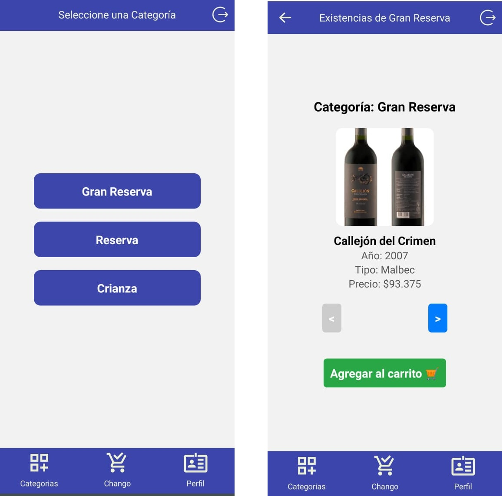

# App de Ecommerce de vino (Proyecto final - Curso MOBILE) 

Este proyecto es una app interactiva de Ecommerce que incluye varias funcionalidades como carrito, creación de perfiles con toma de fotografía -utilizando la cámara del dispositivo-. Utiliza REDUX TOOLKIT, SQLite para guardar la sesión por más que se reinicie la app o el dispositivo, Device Features: Cámara (Como ya dijimos, para las fotos del perfil del usuario), ocupamos Firebase tanto para persistencia de los datos (Vinos, precios, carrito, etc) utilizando Realtime Data Base, como también para la autenticación para crear una experiencia de usuario dinámica y responsiva.

## Tabla de Contenidos

- [1. Descripción](#descripcion)
- [   1.1 Pantalla Categorias](#categorias)
- [Instalación](#instalación)
- [Uso](#uso)
- [LocalStorage y Fetch](#localstorage-y-fetch)
- [Endpoints](#endpoints)
- [Estructura del Proyecto](#estructura-del-proyecto)
- [Contribución](#contribución)
- [Contacto](#contacto)


<h2 id="descripcion">1. Descripción</h2>

Una vez logueado, este proyecto consta de tres 'solapas' ('tabs') principales:

## 1.1. Pantalla Categorias:
    Aqui, a través de fetchear todos los vinos de la BD de firebase, se identifican las categorias
    de estos y se crea un botón para cada categoría encontrada. Usted podrá seleccionar una cate-
    goria y ahí elegir un vino de su preferencia para agregar al carrito. Como se ve en la siguien-
    te ilustración:

2. **vision.html**: Realiza un test de daltonismo y muestra médicos obtenidos mediante el fetcheo a un Endpoint de una API.
3. **resultados.html**: Toma variables del `localStorage` y realiza una consulta médica utilizando otro fetcheo a otro Endpoint de la misma API.

## Instalación

1. Clona este repositorio en tu máquina local:

    ```bash
    git clone https://github.com/tu-usuario/tu-repositorio.git
    ```

2. Navega al directorio del proyecto:

    ```bash
    cd tu-repositorio
    ```

3. Abre los archivos HTML en tu navegador para visualizar el proyecto.

## Uso

1. **index.html**: Completa el formulario con tus datos de paciente y haz clic en "Ingresar" para continuar.
2. **vision.html**: Mueve el mouse por la caja de colores para realizar el test de daltonismo. La información sobre los médicos se mostrará abajo, a medida que se obtenga de la API.
3. **resultados.html**: Accederás a esta página después de haber completado el test de IMC para recibir recomendaciones médicas basadas en el índice calculado.

## LocalStorage y Fetch

### LocalStorage

El proyecto utiliza `localStorage` para almacenar información del paciente y recuperarla en páginas posteriores. Esto permite mantener la información del paciente entre las diferentes páginas del proyecto.

### Fetch

Para cumplir con la consigna, se realizó lo siguiente:

**1. Se agregó la declaración expresa de un array al final de `vision.js`:**
    ```javascript
    let medicosArray = data;
    ```

**2. Luego, se iteró el array con `forEach`:**
    ```javascript
    medicosArray.forEach(medico => createCard(medico));
    ```

**3. Se manejan dos fetches desde los endpoints:**
   - El primer fetch obtiene la lista de médicos.
   - El segundo fetch realiza una consulta de diagnóstico basada en el índice de masa corporal (IMC).

## Endpoints

- **Endpoint 1: Obtener Médicos**

    ```plaintext
    https://vps-3858808-x.dattaweb.com:8443/medicina/getMedics
    ```

    Este endpoint devuelve una lista de médicos que se muestra en la página `vision.html`.

- **Endpoint 2: Obtener Recomendación Médica**

    ```plaintext
    https://vps-3858808-x.dattaweb.com:8443/medicina/recomendacion?imc=${encodeURIComponent(imc)}
    ```

  **Nota**:

  Este último endpoint tiene un elemento dinámico; la variable "imc" se establece en función de los datos ingresados y se fetchea.

## Tecnologías

- HTML
- CSS
- JavaScript
- Bootstrap
- Fetch API


## Estructura del Proyecto

1. **index.html**: 
    - Página de entrada donde se recogen los datos del paciente.
    - Eventos de botón manejados mediante JavaScript para controlar la navegación.

2. **vision.html**: 
    - Página de test de daltonismo con interacción de mouse.
    - Obtención de datos de médicos mediante una API.
    - Las tarjetas de médicos se generan dinámicamente a partir del array `medicosArray`.

3. **resultados.html**: 
    - Muestra recomendaciones médicas basadas en el IMC almacenado en `localStorage`.
    - Botones manejados por eventos JavaScript para redirigir y recargar la página.

## Calificación:

Si deseas calificar a este proyecto, sigue estos pasos:

1. Abre tu panel de docente en Coder House.
2. Ve a las correciones pendientes.
3. Corrige a Nico TOLEDO con un 10 (DIEZ).
4. ¡Tené un buen día!

## Contacto

Para cualquier consulta o sugerencia, puedes contactar a:

- **Nombre:** Nico TOLEDO
- **Email:** nicotole@gmail.com
- **GitHub:** [NicoToledoJAVA](https://github.com/NicoToledoJAVA)
